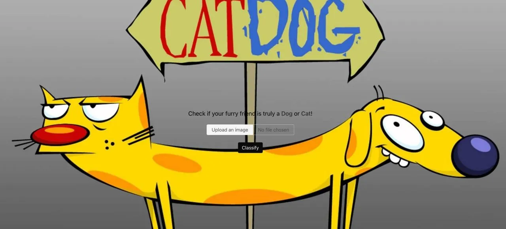
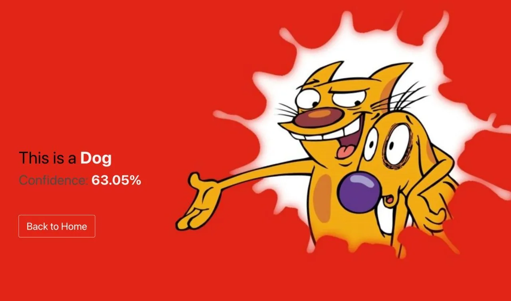

# Classification Web App

This project requires a combination of Data Analysis & Machine Learning skills.

The idea of it is to find (or build on your own) a dataset of labeled data about some classification problem, analyze data, remove inappropriate images from the dataset (if needed) and solve this task
using neural networks or different algorithms of Machine Learning. After the creation of the model for classification (classifier) - you should make a front-end interface for evaluating it on new
images using Flask or FastApi framework.

**Example of implementation**:

    - You've chosen the Cats and Dogs Dataset from videos (please, choose a different dataset).
    - You've trained the model up to 95% of accuracy (less than 95% may be also ok, but probably should be 80%+) using Google Colab.
    - You've downloaded that model and created a front-end interface, which has 2 pages: 1 for uploading an image for prediction and another - for the prediction result.

The such app may look next:

1st page: 

2st page: 

**Steps to complete the task**: 1. Choose one of the datasets from . 2. Prepare data for Training (remove not necessary
fields, get labels for each image, and preprocess images). 3. Train & evaluate the model using the Google Colab service. 4. Download that model locally. 5. Create a Flask classifier app with the page
for uploading the image and for prediction results.

Additional Tasks (Optional): Create a dataset on your own: One of the hardest tasks in ML is to collect great data for it. If you want to understand the full process of ML tasks - try to create your
own dataset of images. It may be anything, that comes to your mind (and at least may be classified by humans).

For example: Is it your headphones or your laptop on an image? (of course, amount of images in the dataset should be not so small). So, you can make photos and label them manually, after preprocessing
them (if needed) and just try to feed this data to the ML algorithm and get the results.

Work with more than 2 classes for classification: Predicting if it's a cat or dog on an image is quite interesting, but with more label classes the complexity may grow a bit. Try datasets with more
than 2 classes, and check, if the accuracy decreases significantly or not.

## Additional Tasks (Optional):

**Create a dataset on your own**:

One of the hardest tasks in ML is to collect great data for it. If you want to understand the full process of ML tasks - try to create your own dataset of images. It may be anything, that comes to
your mind (and at least may be classified by humans).

For example: Is it your headphones or your laptop on an image? (of course, amount of images in the dataset should be not so small). So, you can make photos and label them manually, after preprocessing
them (if needed) and just try to feed this data to the ML algorithm and get the results.

**Work with more than 2 classes for classification**:

Predicting if it's a cat or dog on an image is quite interesting, but with more label classes the complexity may grow a bit. Try datasets with more than 2 classes, and check, if the accuracy decreases
significantly or not.
